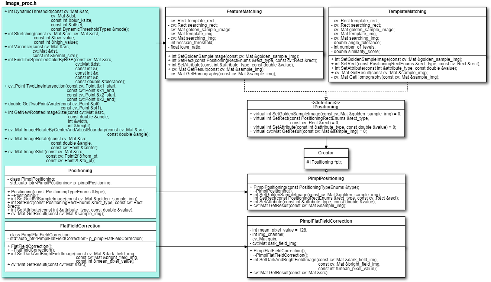

# image-processing-opencv
Some algorithms to do image processing.

## Environment
### Compiler: 
|Win 10|Ubuntu 1604|
|:--:|:--:|
|Visual studio 2017|GCC 7.5.0|

### Third Party
|Package|Version|
|:--:|:--:| 
|OpenCV| 3.4.9| 

# How to build
- build exe
```
// 1. to CMakeLists.txt enable add_executable
// 2. to main.cpp, and select the function you want to test by the index.
// 3. Execute the followng command
// windows
$ cd build
$ build.bat
$ bin\Release\ipo_cv.exe
// linux
$ cd build
$ cmake ..
$ make
$ ./bin/ipo_cv
```
- build dynamic library
```
// 1. to CMakeLists.txt enable add_library
// 2. Execute the followng command
// windows
$ cd build
$ build.bat
// linux
$ cmake ..
$ make
```

# Description
This repository contains image processing, like positioning, flat-field correction, dynamic threshold ...etc. 

# UML Class Diagram


# Function
**enum**
```
enum class DynamicThresholdTypes {
  DYNAMIC_THRES_LIGHT = 0,
  DYNAMIC_THRES_DARK = 1,
  DYNAMIC_THRES_LIGHT_AND_DARK_INRANGE = 2,
  DYNAMIC_THRES_LIGHT_OR_DARK_OUTRANGE = 3,
};
enum PositioningTypeEnums {
  FEATURE_MATCHING = 0,
  TEMPLATE_MATCHING = 1,
};
enum PositioningRectEnums {
  TEMPLATE_IMG_RECT = 0,
  SEARCHING_IMG_RECT = 1,
};
enum FeatureAttributeEnums {
  HESSIAN_THRESHOLD = 0,  // 100~3000
  LOWE_RATIO = 1,         // 0~1.0
};
enum TemplateAttributeEnums {
  ANGLE_TOLERANCE = 0,   // 0~180
  NUMBER_OF_LEVELS = 1,  // 1~5
  THRESHOLD_SCORE = 2,   // 0~1.0
};
```
**DynamicThreshold**
```
int ipo::DynamicThreshold(const cv::Mat &src,
                          cv::Mat &dst,
                          const int &blur_ksize,
                          const int &offset,
                          const DynamicThresholdTypes &mode)
```
    @param src          input image (CV_8UC1 or CV_8UC3).
    @param dst          output image (CV_8UC1).
    @param blur_ksize   blurring kernel size.
    @param offset       the offset value between blurring image and src image.
    @param mode         (DynamicThresholdTypes) switch to the select mode.
    @return             0:ok; -1:error
LIGHT || DARK || LIGHT_AND_DARK_INRANGE || LIGHT_OR_DARK_OUTRANGE


**Stretching**
```
int ipo::Stretching(const cv::Mat &src,
                    cv::Mat &dst,
                    const int &low_value,
                    const int &high_value)
```
    Search for each pixel and set 255 if its pixel value is higher than high_value, and then set 0 if its lower than low_value.
    The pixel value in the range of low_value and high_value will do contrast stretching.

    @param src          input image (CV_8UC1 or CV_8UC3).
    @param dst          output image (CV_8UC1 or CV_8UC3).
    @param low_value    low threshold.
    @param high_value   height threshold.
    @return             0:ok; -1:error
histogram || CV_8UC1 (low_value=100, high_value=200) || CV_8UC3 (low_value=100, high_value=200)


**Variance**
[Variance link to wiki](https://en.wikipedia.org/wiki/Variance)
```
int ipo::Variance(const cv::Mat &src,
                  cv::Mat &dst,
                  const int &kernel_size)
```
    @param src          input image (CV_8UC1 or CV_8UC3).
    @param dst          output image (CV_8UC1).
    @param kernel_size  filter kernel size
    @return             0:ok; -1:error
kernel_size = 3 || kernel_size = 10


**FindTheSpecifiedColorByRGB**
```
int ipo::FindTheSpecifiedColorByRGB(const cv::Mat &src, cv::Mat &dst,
                                       const int &r,
                                       const int &g,
                                       const int &b,
                                       const double &tolerance);
```
    @param src          input image (CV_8UC3).
    @param dst          output image (CV_8UC1).
    @param r            the r channel of the RGB color space
    @param g            the g channel of the RGB color space
    @param b            the b channel of the RGB color space
    @param tolerance    the tolerance of  the rgb color
    @return             0:ok; -1:error


**TwoLineIntersection**
```
cv::Point ipo::TwoLineIntersection(const cv::Point &x1_start,
                              const cv::Point &x1_end,
                              const cv::Point &x2_start,
                              const cv::Point &x2_end);
```
    @param x1_start     the start point by the first line (line 1)
    @param x1_end       the end point by the first line   (line 1)
    @param x2_start     the start point by the second line(line 2)
    @param x2_end       the end point by the second line  (line 2)
    @return             the intersection of two lines


**ImageRotateByCenterAndAdjustBoundary**
```
cv::Mat ipo::ImageRotateByCenterAndAdjustBoundary(const cv::Mat &src,
                                                  const double &angle);
```
    @param src          input image
    @param angle        rotate angle
    @return             rotated image


**positioning by feature/ template matching**
```
class Positioning {
 public:
  Positioning(const PositioningTypeEnums &type);
  ~Positioning();
  int SetGoldenSampleImage(const cv::Mat &golden_sample_img);
  int SetRect(const PositioningRectEnums &rect_type, const cv::Rect &rect);
  int SetAttribute(const int &attribute_type, const double &value);
  cv::Mat GetResult(const cv::Mat &sample_img);
```
  - How to use?
    ```
    Positioning() : Pass the enum type of algorithm you want to execute by the constructor.
    int SetGoldenSampleImage() : Set the golden image.
    int SetRect() : Set ROI rectangle.
    int SetAttribute() : Set the attribute that algorithm needs.
    cv::Mat GetResult() : Get result image.
    ```
  - For example(feature matching) :
    ```
    #include "image_proc.h"
    int main() {
      //----Load images----
      cv::Mat &&golden_sample = cv::imread("../images/positioning/golden_sample.jpg");
      cv::Mat &&sample = cv::imread("../images/positioning/sample.jpg");
      //----crop rect----
      cv::Rect &&searching_rect = cv::Rect(126, 95, 630, 560);
      cv::Rect &&template_rect = cv::Rect(313, 231, 240, 206);

      // Get instance and select positioning alglorithm
      std::shared_ptr<ipo::Positioning> &&position_obj = std::make_shared<ipo::Positioning>(ipo::PositioningTypeEnums::FEATURE_MATCHING);
      if (position_obj->SetGoldenSampleImage(golden_sample) != 0)
        return -1;
      if (position_obj->SetRect(ipo::PositioningRectEnums::SEARCHING_IMG_RECT, searching_rect) != 0)
        return -1;
      if (position_obj->SetRect(ipo::PositioningRectEnums::TEMPLATE_IMG_RECT, template_rect) != 0)
        return -1;
      if (position_obj->SetAttribute(ipo::FeatureAttributeEnums::HESSIAN_THRESHOLD, 100.0f) != 0)
        return -1;
      if (position_obj->SetAttribute(ipo::FeatureAttributeEnums::LOWE_RATIO, 0.9f) != 0)
        return -1;
      cv::Mat &&dst = position_obj->GetResult(sample);
      if (dst.empty())
        return -1;
      cv::imshow("dst", dst);
      cv::waitKey(0);
    }
    ```
  - For example(template matching) :
    ```
    #include "image_proc.h"
    int main() {
      //----Load images----
      cv::Mat &&golden_sample = cv::imread("../images/positioning/golden_sample.jpg");
      cv::Mat &&sample = cv::imread("../images/positioning/sample.jpg");
      //----cropped rect----
      cv::Rect &&searching_rect = cv::Rect(126, 95, 630, 560);
      cv::Rect &&template_rect = cv::Rect(313, 231, 240, 206);

      std::shared_ptr<ipo::Positioning> &&position_obj = std::make_shared<ipo::Positioning>(ipo::PositioningTypeEnums::TEMPLATE_MATCHING);
      if (position_obj->SetGoldenSampleImage(golden_sample) != 0)
        return -1;
      if (position_obj->SetRect(ipo::PositioningRectEnums::SEARCHING_IMG_RECT, searching_rect) != 0)
        return -1;
      if (position_obj->SetRect(ipo::PositioningRectEnums::TEMPLATE_IMG_RECT, template_rect) != 0)
        return -1;
      if (position_obj->SetAttribute(ipo::TemplateAttributeEnums::ANGLE_TOLERANCE, 20) != 0)
        return -1;
      if (position_obj->SetAttribute(ipo::TemplateAttributeEnums::NUMBER_OF_LEVELS, 1) != 0)
        return -1;
      if (position_obj->SetAttribute(ipo::TemplateAttributeEnums::THRESHOLD_SCORE, 0.8) != 0)
        return -1;
      cv::Mat &&dst = position_obj->GetResult(sample);
      if (dst.empty())
        return -1;
      cv::imshow("dst", dst);
      cv::waitKey(0);
    }
    ```
Golden image || sample image || result : feature matching || result : template matching


**Flate-Field-Correction**
It cancels the effects of image artifacts caused by variations in the pixel-to-pixel sensitivity of the detector and by distortions in the optical path.
[Image Source:](https://rawpedia.rawtherapee.com/File:Flatfield_landscape.jpg#file)
[link to wiki](https://en.wikipedia.org/wiki/Flat-field_correction)
```
class FlatFieldCorrection {
 public:
  FlatFieldCorrection();
  ~FlatFieldCorrection();
  int SetDarkAndBrightFieldImage(const cv::Mat &dark_field_img,
                                 const cv::Mat &bright_field_img,
                                 const int &mean_pixel_value);
  cv::Mat GetResult(const cv::Mat &src);
}
```
  - How to use?
  ```
  int SetDarkAndBrightFieldImage() : Set dark_field_img and bright_field_img.
                                     mean_pixel_value can adjust the brightness of image. 
  cv::Mat GetResult() : Get result image.
  ```
  - For example :
  ```
  #include "image_proc.h"
  int main() {
    //----Load images----
    cv::Mat &&dark_field = cv::imread("../images/flat-field-correction/dark.jpg", 0);
    cv::Mat &&bright_field = cv::imread("../images/flat-field-correction/bright.jpg", 0);
    cv::Mat &&sample = cv::imread("../images/flat-field-correction/sample.jpg", 0);

    std::shared_ptr<ipo::FlatFieldCorrection> &&obj = std::make_shared<ipo::FlatFieldCorrection>();
    if (obj->SetDarkAndBrightFieldImage(dark_field, bright_field, 200) != 0)
      return -1;
    cv::Mat &&dst = obj->GetResult(sample);
    if (dst.empty()) {
      return -1;
    }
    cv::imwrite("../images/result/FlatFieldCorrection/CV_8UC1.jpg", dst);
    cv::imshow("dst", dst);
    cv::waitKey(0);
    return 0;
  }
  ```
  input image : original image || dark field image || bright field image


  Output image : CV_8UC1 || CV_8UC3


**Use google breakpad to build dump File**
[google breakpad github](https://github.com/google/breakpad)
- Description :
  It can catch the core dump if it occurs in the program, you can know where it happened.
- For example :
```
#ifdef _WIN32
#include "client/windows/handler/exception_handler.h"
bool callback(const wchar_t *dump_path, const wchar_t *id,
              void *context, EXCEPTION_POINTERS *exinfo,
              MDRawAssertionInfo *assertion, bool succeeded) {
  if (succeeded)
    std::cout << "Create dump file success" << std::endl;
  else
    std::cout << "Create dump file failed" << std::endl;
  return succeeded;
}
#endif
int main() {
#ifdef _WIN32
  const wchar_t *dumpPath = L"../dump_file/log";
  google_breakpad::ExceptionHandler eh(
      dumpPath, NULL, callback, NULL,
      google_breakpad::ExceptionHandler::HANDLER_ALL);
#endif
  std::cout << "main start" << std::endl;
  // A program that will cause a core dump.
  int *a = NULL;
  *a = 0x1;
  std::cout << "main end" << std::endl;
  return 0;
}
```
- How to use dump file to debug? (Windows)
```
// 1. use CMakelists.txt build .pdb
// 2. If your program occur core dump, it will build a dump file.
// 3. Put .dll & .pdb & .dmp in the same folder location.
// 4. Double click to open .dmp file.
```
