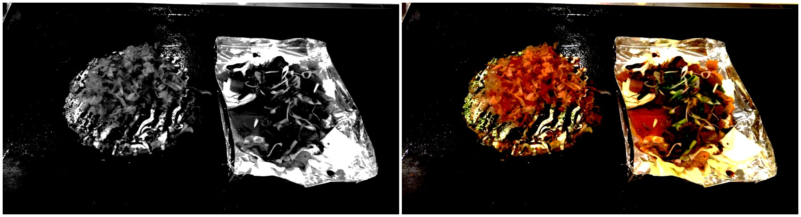

# Description
About the SDK program architecture of computer vision algorithms written in C++ and OpenCV.

The computer vision algorithms in this notion are contained object location(Template Matching, Pattern Matching, Feature Matching), flat-field-correction, contrast stretching, variance..., etc.

The following content will introduce the software architecture and the usage and effects of each API.
# Documentation
[You can find for more details form my notion.](https://www.notion.so/Image-processing-API-86c70706d0a54d7fabe10d39142fda86)

# Getting Started
## Environment
### Compiler: 
|Win 10|Ubuntu 1604|
|:--:|:--:|
|Visual studio 2017|GCC 7.5.0|
### Open Source
|Package|Version|
|:--:|:--:| 
|OpenCV| 3.4.9| 

## Installation
[OpenCV installation](https://www.notion.so/OpenCV-installation-a1f27780ac1548d6bcee6b40ced6b008)

# Build
## Executable
1. To CMakeLists.txt enable "add_executable"
2. To main.cpp, and select the function you want to execute by the index.
3. Execute the following command

  ~Windows~
  ```
  $ cd build
  $ build.bat
  $ bin\Release\ipo_cv.exe
  ```
  ~Ubuntu~
  ```
  $ cd build
  $ cmake ..
  $ make
  $ ./bin/ipo_cv
  ```
## Dynamic Library
1. To CMakeLists.txt enable "add_library"
2. Execute the following command

  ~Windows~
  ```
  $ cd build
  $ build.bat
  ```
  ~Ubuntu~
  ```
  $ cmake ..
  $ make
  ```

# API
### **Dynamic Threshold**
  ###### Description
  This algorithm is refer to threshold operator from **Halcon**.
Inspect the differences between images. The input image and mean of the image are compared pixel by pixel. 
  ###### method
```
enum class DynamicThresholdTypes {
  DYNAMIC_THRES_LIGHT = 0,
  DYNAMIC_THRES_DARK = 1,
  DYNAMIC_THRES_LIGHT_AND_DARK_INRANGE = 2,
  DYNAMIC_THRES_LIGHT_OR_DARK_OUTRANGE = 3,
};

/**
 * @param src          Input image (CV_8UC1 or CV_8UC3).
 * @param dst          Output image (CV_8UC1).
 * @param blur_ksize   Blurring kernel size.
 * @param offset       The sensitivity of the dynamic threshold operator.
 * @param mode         (DynamicThresholdTypes) switch to the select mode.
 * @return             0:ok; -1:error
**/
int ipo::DynamicThreshold(const cv::Mat &src,
                          cv::Mat &dst,
                          const int &blur_ksize,
                          const int &offset,
                          const DynamicThresholdTypes &mode)
```
###### Demo

LIGHT || DARK || LIGHT_AND_DARK_INRANGE || LIGHT_OR_DARK_OUTRANGE

### **Stretching**
  ###### Description
  This algorithm is refer to threshold operator from **ImageJ**.
Contrast stretching is an Image Enhancement method that attempts to improve an image by stretching the range of intensity values.
For example, Search for each pixel and set 255 if its pixel value is higher than high_value, and then set 0 if it's lower than low_value.
The pixel value in the range of low_value and high_value will do contrast stretching.
  ###### Method
```
/**
 * @param src          input image (CV_8UC1 or CV_8UC3).
 * @param dst          output image (CV_8UC1 or CV_8UC3).
 * @param low_value    low threshold.
 * @param high_value   height threshold.
 * @return             0:ok; -1:error
**/
int ipo::Stretching(const cv::Mat &src,
                    cv::Mat &dst,
                    const int &low_value,
                    const int &high_value)
```
  ###### Demo
  
  origin histogram  ||  histogram after stretching
  
  CV_8UC1 || CV_8UC3

### **Variance**
###### Description
This algorithm is refer to threshold operator from ImageJ.
Highlight edges in the image by replacing each pixel with the neighborhood variance.
[Variance link to wiki](https://en.wikipedia.org/wiki/Variance)
###### Method
```
/**
 * @param src          input image (CV_8UC1 or CV_8UC3).
 * @param dst          output image (CV_8UC1).
 * @param kernel_size  filter kernel size
 * @return             0:ok; -1:error
**/

int ipo::Variance(const cv::Mat &src,
                  cv::Mat &dst,
                  const int &kernel_size)
```
###### Demo

kernel_size = 3 || kernel_size = 10

### **FindTheSpecifiedColorByRGB**
###### Description
Highlight edges in the image by replacing each pixel with the neighborhood variance.
###### Method
```
/**
 * @param src          input image (CV_8UC3).
 * @param dst          output image (CV_8UC1).
 * @param r            the r channel of the RGB color space
 * @param g            the g channel of the RGB color space
 * @param b            the b channel of the RGB color space
 * @param tolerance    the tolerance of  the RGB color
 * @return             0:ok; -1:error
**/

int ipo::FindTheSpecifiedColorByRGB(const cv::Mat &src, cv::Mat &dst,
                                       const int &r,
                                       const int &g,
                                       const int &b,
                                       const double &tolerance);
```
###### Demo


### **TwoLineIntersection**
###### Description
Get the intersection of two lines.
###### Method
```
/**
 * @param x1_start     the start point by the first line (line 1)
 * @param x1_end       the end point by the first line   (line 1)
 * @param x2_start     the start point by the second line(line 2)
 * @param x2_end       the end point by the second line  (line 2)
 * @return             the intersection of two lines
**/

cv::Point ipo::TwoLineIntersection(const cv::Point &x1_start,
                              const cv::Point &x1_end,
                              const cv::Point &x2_start,
                              const cv::Point &x2_end);
```
###### Demo


### **ImageRotateByCenterAndAdjustBoundary**
###### Description
Rotate with the center point of the picture, and its boundary will be adjusted according to the picture boundary after rotation.
###### Method
```
/**
 * @param src          input image(CV_8UC1 || CV_8UC3)
 * @param angle        rotate angle(CV_8UC1 || CV_8UC3)
 * @return             rotated image
**/

cv::Mat ipo::ImageRotateByCenterAndAdjustBoundary(const cv::Mat &src,
                                                  const double &angle);
```
###### Demo


### **positioning by feature/ template matching**
###### Description
  * **Feature Matching:**
    [OpenCV doc](https://docs.opencv.org/3.4/d5/d6f/tutorial_feature_flann_matcher.html)
    Use feature descriptors to compare and match using the Euclidean distance between the template image and the searching image.
    Use feature descriptors to compare and match using the Euclidean distance between the template image and the searching image.
  * **Template Matching:**
    [OpenCV doc](https://docs.opencv.org/master/d4/dc6/tutorial_py_template_matching.html)
    And then find 3 points with the highest score to calculate the homography matrix, and using this matrix to find angle and coordinate.
###### Method
  * Positioning() : Pass the enum type of algorithm you want to execute by the constructor.
  * int SetGoldenSampleImage() : Set the golden image.
  * int SetRect() : Set ROI rectangle.
  * int SetAttribute() : Set the attribute that algorithm needs.
  * cv::Mat GetResult() : Get result image.
  ```
  enum PositioningTypeEnums {
  FEATURE_MATCHING = 0,
  TEMPLATE_MATCHING = 1,
  };
  enum PositioningRectEnums {
    TEMPLATE_IMG_RECT = 0,
    SEARCHING_IMG_RECT = 1,
  };
  enum FeatureAttributeEnums {
    HESSIAN_THRESHOLD = 0,  // 100~3000
    LOWE_RATIO = 1,         // 0~1.0
  };
  enum TemplateAttributeEnums {
    ANGLE_TOLERANCE = 0,   // 0~180
    NUMBER_OF_LEVELS = 1,  // 1~5
    THRESHOLD_SCORE = 2,   // 0~1.0
  };

  class Positioning {
    public:
      Positioning(const PositioningTypeEnums &type);
      ~Positioning();
      int SetGoldenSampleImage(const cv::Mat &golden_sample_img);
      int SetRect(const PositioningRectEnums &rect_type, const cv::Rect &rect);
      int SetAttribute(const int &attribute_type, const double &value);
      cv::Mat GetResult(const cv::Mat &sample_img);
  };
  ```
###### Demo
  
  Golden image || sample image || result : feature matching || result : template matching

### **Flate-Field-Correction**
  ###### Description
[wiki](https://en.wikipedia.org/wiki/Flat-field_correction)
[Image Source:](https://rawpedia.rawtherapee.com/File:Flatfield_landscape.jpg#file)
A technique used to improve quality in digital imaging. It cancels the effects of image artifacts caused by variations in the pixel-to-pixel sensitivity of the detector and by distortions in the optical path.
  ###### Method
  * int SetDarkAndBrightFieldImage() : Set dark field image, bright field image and mean_pixel_value for imageaverage brightness.
  * cv::Mat GetResult() : Get result image.
```
class FlatFieldCorrection {
 public:
  FlatFieldCorrection();
  ~FlatFieldCorrection();
  int SetDarkAndBrightFieldImage(const cv::Mat &dark_field_img,
                                 const cv::Mat &bright_field_img,
                                 const int &mean_pixel_value);
  cv::Mat GetResult(const cv::Mat &src);
};
```
  ###### Demo
  
  input image : original image || dark field image || bright field image

  
  Output image : CV_8UC1 || CV_8UC3

### **Use google breakpad to build dump File**
[google breakpad github](https://github.com/google/breakpad)
###### Description :
  Breakpad is a set of client and server components which implement a crash-reporting system.
  It can catch the core dump if it occurs in the program, you can know where it happened.
###### For example (for Windows):
1. In CMakeList.txt
  * build .pdb
  ```
  set(CMAKE_CXX_FLAGS_RELEASE "${CMAKE_CXX_FLAGS_RELEASE} /Zi")
  ```
  * choose shared/static/exe to build
  ```
  # SHARED
  #set(CMAKE_SHARED_LINKER_FLAGS_RELEASE "${CMAKE_EXE_LINKER_FLAGS_RELEASE} /DEBUG /OPT:REF /OPT:ICF")
  # EXE
  set(CMAKE_EXE_LINKER_FLAGS_RELEASE "${CMAKE_EXE_LINKER_FLAGS_RELEASE} /DEBUG /OPT:REF /OPT:ICF")
  ```
2. This program will produce the dump file:
  ```
  #ifdef _WIN32
  #include "client/windows/handler/exception_handler.h"
  bool callback(const wchar_t *dump_path, const wchar_t *id,
                void *context, EXCEPTION_POINTERS *exinfo,
                MDRawAssertionInfo *assertion, bool succeeded) {
    if (succeeded)
      std::cout << "Create dump file success" << std::endl;
    else
      std::cout << "Create dump file failed" << std::endl;
    return succeeded;
  }
  #endif
  int main() {
  #ifdef _WIN32
    const wchar_t *dumpPath = L"../dump_file/log";
    google_breakpad::ExceptionHandler eh(
        dumpPath, NULL, callback, NULL,
        google_breakpad::ExceptionHandler::HANDLER_ALL);
  #endif
    std::cout << "main start" << std::endl;
    // A program that will cause a core dump.
    int *a = NULL;
    *a = 0x1;
    std::cout << "main end" << std::endl;
    return 0;
  }
  ```
3. Put .dll & .pdb & .dmp in the same folder location.
4. Double click to open .dmp file (with Visual Studio).